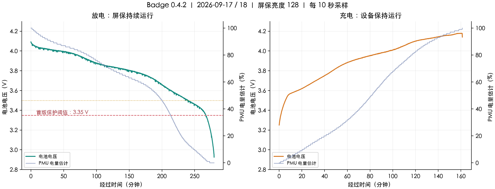

# 电池完整周期分析（2026-09-17 至 18）

数据：`20260917-180915-893121/samples.csv`，共 6072 条采样（北京时间）。原始记录未改动。

## 结论

- 完整放电：09-17 18:17:16 → 09-17 22:56:56，最后在线为止 **4 小时 39 分 40 秒**。
  该段持续屏保、亮度 128、Wi-Fi 在线、麦克风和 IMU 参与粒子渲染；不是关屏或深睡续航。
- 最后在线电压 **2.926V**；下一次请求超时。结合用户确认，本段为耗尽实验，但日志没有精确的物理断电时间。
- 次日充电：09-18 08:16:56 → 09-18 10:58:16，首次记录到充电至 PMU 报充满 **2 小时 41 分 20 秒**。
  起点设备 uptime=10 秒，可能略晚于实际插电；充满由 standby + 100% + PMU 状态码 4 共同判断。
- 前面还有一次约 3 分钟补电，已排除，不与完整充电周期混算；夜间离线段不计入放电或充电时长。
- 充电中途发生 uptime 回退：09-18 08:56:17。没有复位原因日志，不能归因为电池、固件或人工操作。
- PMU 百分比在完整放电段单调下降，但不是线性的剩余时间：50% 时只剩约 87 分钟（总观察时长的约 31%）。
  显示时标为电量估计，不据此估算精确剩余分钟；单次记录不足以重标定电量计。

## 放电关键点

| PMU 电量 | 时间 | 电压 | 距最后在线 |
|---:|---|---:|---:|
| 80% | 09-17 19:42:05 | 3.919V | 194.8 分钟 |
| 50% | 09-17 21:30:16 | 3.693V | 86.7 分钟 |
| 20% | 09-17 22:06:16 | 3.543V | 50.7 分钟 |
| 15% | 09-17 22:14:06 | 3.512V | 42.8 分钟 |
| 10% | 09-17 22:25:06 | 3.470V | 31.8 分钟 |
| 5% | 09-17 22:36:56 | 3.418V | 20.0 分钟 |
| 3% | 09-17 22:41:16 | 3.387V | 15.7 分钟 |
| 1% | 09-17 22:45:56 | 3.325V | 11.0 分钟 |
| 0% | 09-17 22:50:16 | 3.225V | 6.7 分钟 |

## 充电关键点

| PMU 电量 | 从首次充电样本起 | 电压 |
|---:|---:|---:|
| 20% | 39.5 分钟 | 3.747V |
| 50% | 80.8 分钟 | 3.954V |
| 80% | 116.0 分钟 | 4.084V |
| 90% | 132.5 分钟 | 4.127V |
| 95% | 144.5 分钟 | 4.154V |
| 99% | 158.3 分钟 | 4.178V |
| 100% | 161.3 分钟 | 4.141V |

## 首版管理策略

- 保留 PMU 百分比显示，附带电压、充电/充满和低电提示。
- 仅电池供电时，≤15% 或 ≤3.50V 持续 15 秒进入低电模式：亮度最高 64，空闲 10 秒直接熄屏，不启动耗电屏保。
- ≤3.35V 连续有效采样 15 秒，重新检查未接 USB、电池仍在且电压仍低，再请求 AXP2101 关机；不等待 0%/2.9V。
  本轮首次 3.35V 以下距最后在线约 12.5 分钟；新策略会改变负载，不能直接断言新续航损失相同。
- 关机依据电压，不依据可能失准的百分比；USB 供电、读取失败、过期或不连续样本不能触发误关机。
- 低电恢复采用迟滞：断开 USB 时要求 ≥3.60V 且 ≥20%（百分比未知则只看电压）持续 30 秒；接上有效 USB 立即解除。
- 正常空闲 10 秒进入屏保，屏保最多 5 分钟，然后面板休眠并停止采音和渲染；Wi-Fi 与电池查询保留。
- 阈值是针对当前样机的首版保守软件策略，不替代电池保护板，也不改充电电流、充电终止电压和 PMU 硬件保护。
- 没有电流/容量测量，无法由本记录计算 mAh、充电功率或保证新固件续航；改动后需再跑一个周期比较。

